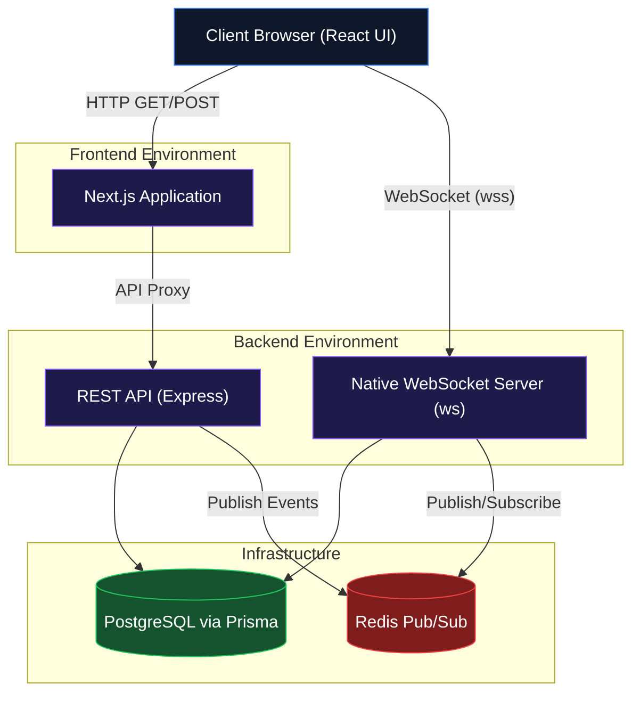
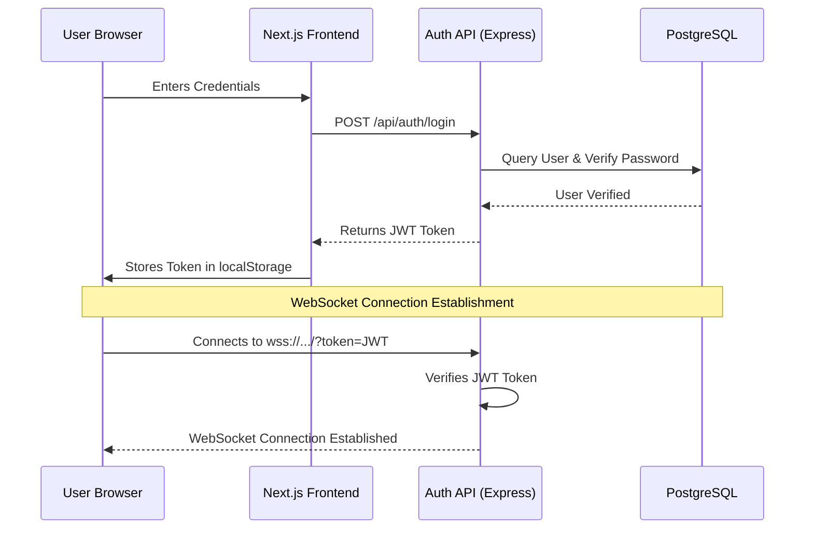
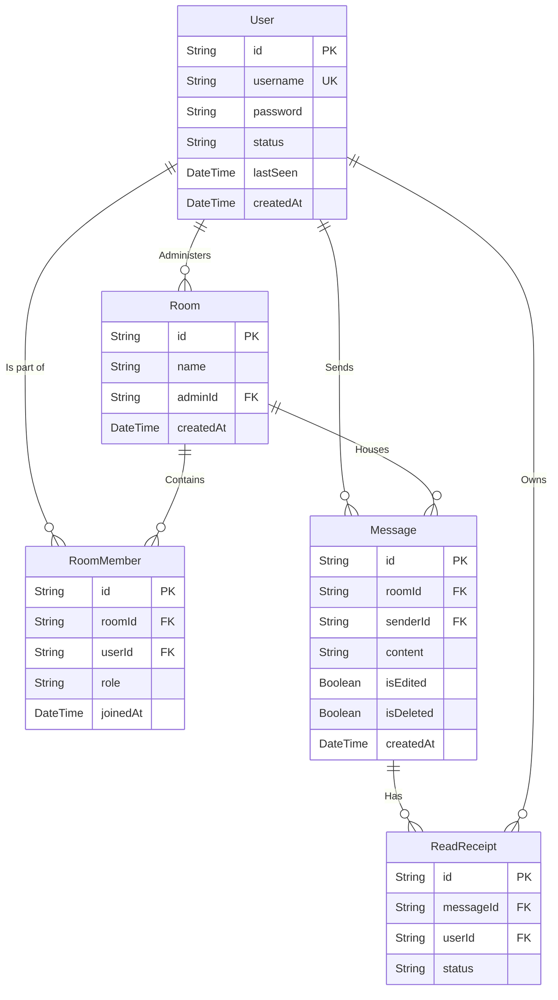
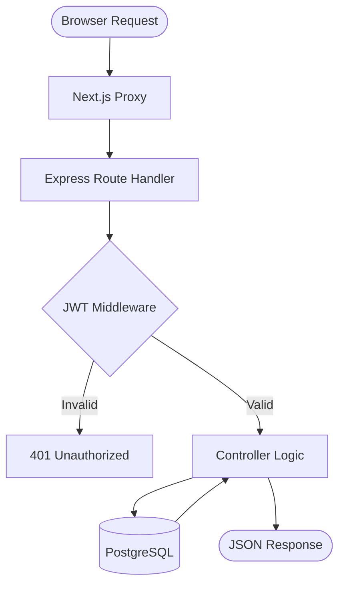
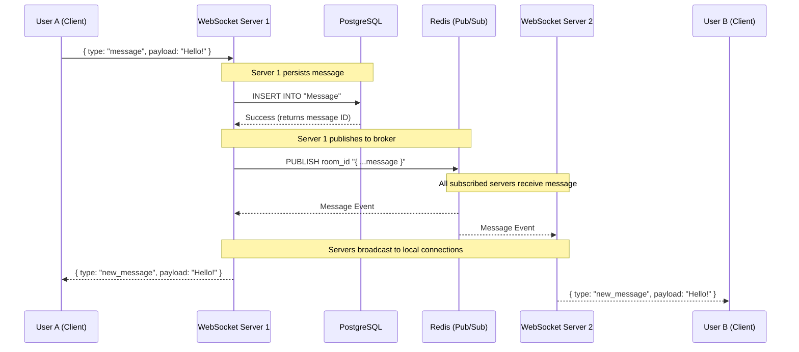

<div align="center">

# SyncSphere — Real-Time Chat Architecture

**A highly scalable, real-time chat application built with Next.js, Node.js, WebSockets, Redis Pub/Sub, and PostgreSQL.**

<div align="center" style="margin-top: 20px;">
  
  
  
  
  
  
</div>

</div>

---

## 🌟 Features

| Category | Features |
|---|---|
| **Real-Time Engine** | Native WebSocket connections managed by a custom Node.js server. |
| **Scalable Architecture** | Redis Pub/Sub integration allows horizontal scaling of WebSocket servers without sticky sessions. |
| **Authentication** | JWT-based authentication for secure messaging and user sessions. |
| **Persistent Storage** | PostgreSQL database with Prisma ORM for robust data integrity and message history. |
| **Dynamic UI** | Built with Next.js App Router, React 19, and TailwindCSS for a highly responsive, modern glassmorphic interface. |
| **Rooms & Presence** | Join via Room ID, view online members, real-time typing indicators, and instant read receipts. |
| **Dockerized** | Fully containerized environment using Docker Compose for instant local deployment. |

---

## 🛠️ Tech Stack

### Frontend
| Technology | Purpose |
|---|---|
| [Next.js (App Router)](https://nextjs.org/) | React Framework & Client Routing |
| [React 19](https://react.dev/) | UI Library |
| [TailwindCSS 4](https://tailwindcss.com/) | Utility-first CSS framework |
| [TypeScript](https://www.typescriptlang.org/) | Strict Type Safety |

### Backend & Infrastructure
| Technology | Purpose |
|---|---|
| [Node.js](https://nodejs.org/) | High-performance Runtime |
| [Express](https://expressjs.com/) | REST API Framework |
| [ws](https://github.com/websockets/ws) | Native WebSocket server |
| [Redis](https://redis.io/) | Message broker & Pub/Sub for scalability |
| [PostgreSQL](https://www.postgresql.org/) | Primary Relational Database |
| [Prisma](https://www.prisma.io/) | Next-generation ORM |
| [Docker](https://www.docker.com/) | Containerization & Orchestration |

---

## 1. System Architecture Diagram

This diagram shows how all components connect and interact to provide a seamless, horizontally scalable chat experience.



---

## 2. Folder Structure

A clean, monorepo-style structure separating the frontend application from the scalable backend architecture.

```text
SyncSphere/
├── app/                             # Next.js Frontend (App Router)
│   ├── api/                         # Next.js API Routes (Proxy to Backend)
│   ├── room/[roomId]/               # Dynamic Chat Room UI & Hooks
│   │   ├── components/              # ChatHeader, MessageList, etc.
│   │   └── hooks/                   # useMessages, useWebSocket, useTyping
│   ├── page.tsx                     # Dashboard & Authentication
│   └── globals.css                  # Tailwind styles
├── backend/                         # Node.js WebSocket & REST Server
│   ├── src/
│   │   ├── index.ts                 # Express & WS Server Entry
│   │   └── redis.ts                 # Redis Pub/Sub Singleton
│   ├── prisma/
│   │   └── schema.prisma            # DB Models (User, Room, Message)
│   └── Dockerfile                   # Backend Container Config
├── public/                          # Static Assets (Images, Icons)
├── docker-compose.yml               # Multi-container orchestration
└── next.config.ts                   # Next.js Proxy Configuration
```

---

## 3. Authentication Flow

How users securely authenticate and establish both HTTP sessions and WebSocket connections.



---

## 4. Database ER Diagram

The core schema design managed via Prisma.



---

## 5. Request Flow

The standard lifecycle of a REST API request in SyncSphere.



---

## 6. Real-time Message Flow ⭐

This is how SyncSphere achieves real-time communication across multiple, load-balanced WebSocket servers using Redis Pub/Sub.



---

## ⚙️ Quick Start (Docker)

The fastest way to run SyncSphere locally is using Docker Compose. This spins up PostgreSQL, Redis, the Node.js Backend, and the Next.js Frontend simultaneously.

### 1. Clone the repository
```bash
git clone https://github.com/Harshgg1/SyncSphere.git
cd SyncSphere
```

### 2. Configure Environment
A default `.env.example` is provided. You can optionally create a `.env` in both the root and `backend/` directories for custom overrides.

### 3. Spin up the cluster
```bash
docker compose up --build
```

### 4. Access the Application
- **Frontend UI:** Open your browser to `http://localhost:3000`
- **Backend API:** Running on `http://localhost:8080`
- **WebSocket:** Running on `ws://localhost:8080`

---

## 🧪 Manual Setup (Without Docker)

If you prefer to run services manually on your local machine:

**1. Prerequisites**
Ensure you have **Node.js (v20+)**, **PostgreSQL**, and **Redis** running locally.

**2. Backend Setup**
```bash
cd backend
npm install
npm run db:migrate   # Setup PostgreSQL tables
npm run db:generate  # Generate Prisma Client
npm run dev          # Starts on port 8080
```

**3. Frontend Setup** (In a new terminal)
```bash
# From the project root
npm install
npm run dev          # Starts on port 3000
```

---

<div align="center">
<i>Built with passion by <a href="https://github.com/Harshgg1">Harshgg1</a></i>
</div>